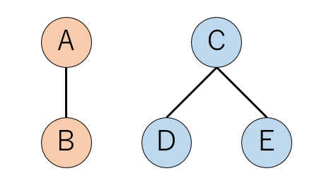
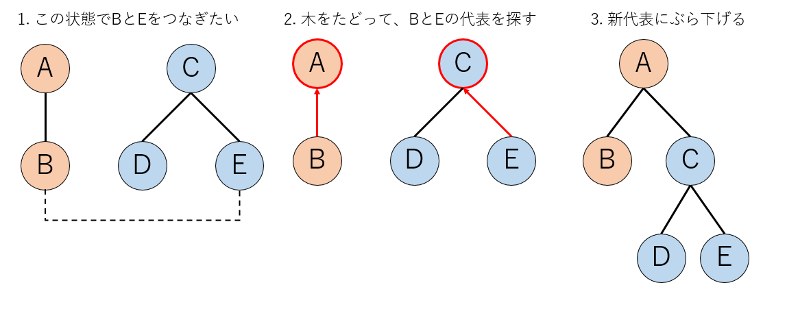
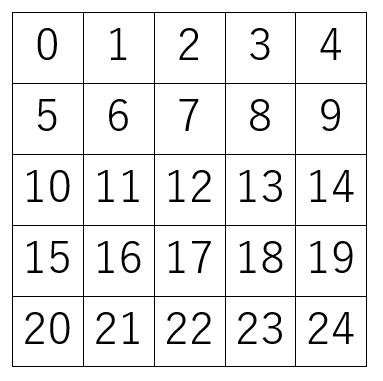
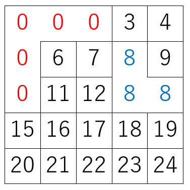
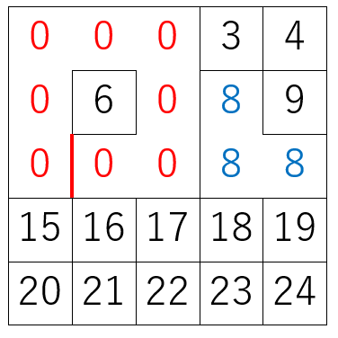
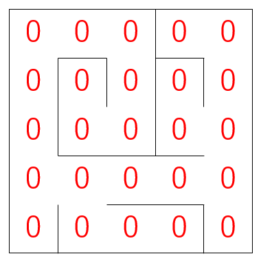
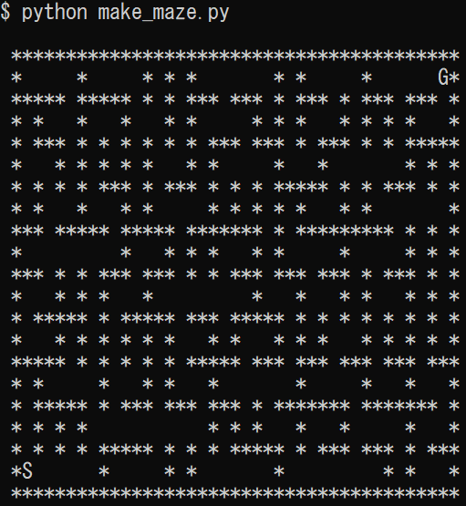
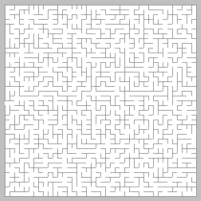
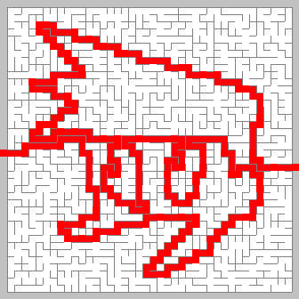

# クラスタリングによる迷路作成アルゴリズム

## はじめに

クラスタリングアルゴリズムという手法を使って迷路を作ります。この記事は昔、他の場所に書いた記事の転載です。

## クラスタリングとは

今日、「クラスタリング」というと、ほぼ教師無し学習におけるデータ分類を指すと思います。しかし、統計物理、特にモンテカルロ法でスピン系なんかを研究する(非常に狭い)界隈では「つながった要素をグループごとに分ける」という意味に使います。ここでは「クラスタリング」という言葉を後者の意味で使うのでご注意ください。

いま、AさんとBさんが友達だとします。またBさんとCさんも友達だとしましょう。ここで「友達の友達もまた友達である」と定義すると、友達は同値類を作ります。いま、「誰と誰が友達か」のリストが与えられたとき、いくつかの友達グループができることになります。この時、友達グループはいくつできるか、一番大きなグループは何人含むか、グループの平均人数は何人か、などが知りたくなります。我々はこのグループ分けをクラスタリングと呼んでます。

例えばいま、こんな友達リストが与えられたとしましょう。

```txt
A=B
C=D
C=E
```

`A=B`はAさんとBさんが友達という意味です。この時、AさんグループとCさんグループの二つのグループができています。わかりやすいように色を塗りましょう。



この後、実はBさんとEさんが友達だとわかったとしましょう。これをAさんグループと呼ぶにせよ、Cさんグループと呼ぶにせよ、とにかく二つのグループを一つにまとめなくてはなりません。しかし、新たな友人関係が見つかるたびに全部の色の塗り替えをすると大変です。このような場合に使うのがUnion-Find Algorithmです。

Union-Findアルゴリズムでは、まず全ての要素に背番号をつけておきます。そして自分の所属するグループの一番若い番号の人を「自分の所属するグループの代表」とし、その番号を「自分のグループの番号(クラスターインデックス)」とします。ここで、要素Xと要素Yをつなげたい場合、まずX,Yの所属するグループの代表を探します。それをC(X)、C(Y)としましょう。いま、Xのグループの代表C(X)の方がYのグループの代表C(Y)よりも背番号が若かったとしましょう。このとき、C(Y)の所属するグループをC(X)にぶら下げます。しかし、C(Y)に所属していたグループの要素については何もしません。後で要素Yが所属するグループ番号を知りたくなったら、木をたどっていって、一番上(根)まで到達したら、それが要素の代表です。

今回の例に適用するとこんな感じになります。

1. まずBさんとEさんの所属するグループの代表をたどります。それぞれAさんとCさんです。
2. 次に、AさんとCさんの背番号の若い方に、そうでない方をぶら下げます。今回のケースでは、AさんにCさんをぶら下げます。
3. 今回の処理では、「CさんをAさんにぶら下げる」という処理しかしていませんが、自動的にDさんもEさんもAさんのグループになります。



Union-Findは一次元配列によるリンクリストで実装できて、計算量はおおよそ$O(N)$です。その実装例については[Union-Find木のサンプルコード](https://qiita.com/kaityo256/items/5a3b03ff465778c23f6a)に書いたので参照してください。

こうして、「つながった要素別々のグループに分ける」ことができるようになりました。以下、「自分の所属するグループの、代表要素の背番号」を「クラスタ番号(cluster index)」と呼びます。

## クラスタリングの迷路への応用

さて、クラスタリングができるようになると、これを応用して迷路を作ることができます。迷路作成には様々なアルゴリズムがありますが、とりあえず迷路が満たすべき条件として「ループがない」「死に領域がない」というのが挙げられます。

「ループがない」とは、ある場所から別の場所に行く道が一つしかない、という意味です。「死に領域」とは、スタート地点から絶対に行くことができない、隔離された領域で、もちろん無い方が好ましいです。クラスタリングを使うと、それらが両方がないことが保証された迷路を簡単に作ることができます。

まず、全ての部屋に通し番号をつけておきます。



ランダムに壁を壊し、クラスタリングします。



同じクラスタ番号の部屋を隔てる壁(図の赤い壁)は壊してはいけません(ループを作らない保証)。



全ての部屋が同じクラスタ番号になるまで続けます(死に領域ができない保証)。



というわけで迷路完成です[1]。

[1]:このアルゴリズムを見て「クラスカル法(Kruskal's algorithm)だ」と言った人がいました。確かにクラスカル法の、全ての辺の重みが等しいという特殊な場合になっていますが、あまりに単純化されすぎているので、単にクラスタリング、もしくはUnion-Findアルゴリズムと呼んだ方がいいんじゃないかな、という気がします。

## Pythonによる実装例

上記のクラスタリングによる迷路作成アルゴリズムをPythonで実装してみましょう。

まず、迷路は単純に二次元リストで実装しましょう。m行n列の迷路を作りたい場合、とりあえず全部`*`で埋めた二次元リストを作り、適宜`*`を消すことで迷路を表現しましょう。

```py
maze = [['*']*(2*n+1) for i in range(2*m+1)]
```

壁の表現方法としては、縦と横の壁を別々に扱う方法もありますが、ここでは単純に二つの隣接する部屋の座標で表現することにしましょう。あらかじめ「壁リスト」を作っておきます。

```py
    walls = []
    for r in range(m):
        for c in range(n):
            maze[2*r+1][2*c+1] = ' '
            if r != m-1:
                walls.append([r, c, r+1, c])
            if c != n-1:
                walls.append([r, c, r, c+1])
```

各部屋のクラスタ番号を管理するための、クラスタインデックスリストも作っておきます。単に一次元の連番リストを作るだけなので簡単です。

```py
cluster_index = [i for i in range(m*n)]
```

さて、これからランダムに壁を壊すわけですが、少なくともすべての壁を壊せば死に領域はなくなります。なので、壁リストをシャッフルして、その順番に壊していくことにしましょう。壁を壊す関数を`break_wall`として実装します。また、「すべての部屋が同じクラスタ番号になった」ら終了です。その終了判定を`check_finish`としましょう。迷路を作る部分はこうなります。

```py
    for w in walls:
        break_wall(w, n, cluster_index, maze)
        if check_finish(cluster_index):
            break
```

壁を壊す部分はこんな感じに書けます。

```py
def break_wall(w, n, cluster_index, maze):
    """
    指定された壁(w)を壊してクラスタリング
    """
    ri, ci, rj, cj = w
    i = ci + ri * n
    j = cj + rj * n
    cli = get_cluster_index(i, cluster_index)
    clj = get_cluster_index(j, cluster_index)
    # 同じクラスタに属す部屋は壊さない
    if cli == clj:
        return
    connect(cli, clj, cluster_index)
    if ci == cj:
        # 縦の壁を壊す
        maze[ri*2+2][ci*2+1] = ' '
    else:
        # 横の壁を壊す
        maze[ri*2+1][ci*2+2] = ' '
```

まず、壁の両隣にある部屋のクラスタ番号を`get_cluster_index`で取得します。リンクリストをたどっていって、`cluster_index[i] = i`になったらそこが根なので、それを返すだけです。

```py
def get_cluster_index(i, cluster_index):
    while cluster_index[i] != i:
        i = cluster_index[i]
    return i
```

部屋をつなげる処理`connect`も、「クラスタ番号の若い方に、そうでない方をぶら下げる」だけです。

```py
def connect(ci, cj, cluster_index):
    if ci > cj:
        ci, cj = cj, ci
    cluster_index[cj] = ci
```

終了判定`check_finish`ですが、すべての部屋について、クラスタ番号が0番でない奴がいたら偽、全部0なら真を返すだけです。$O(N^2)$になりますが、まぁ、どうせサイズが小さいので無視できる計算量です。

```py
def check_finish(cluster_index):
    """
    終了判定
    すべての壁が同じクラスター番号になったら壁の破壊をやめる
    """
    for i in range(len(cluster_index)):
        if get_cluster_index(i, cluster_index) != 0:
            return False
    return True
```

最後に、迷路のスタート地点と終了地点を置きましょう。とりあえず安直に左下と右上に置きます。

```py
    maze[2*m-1][1] = 'S'
    maze[1][2*n-1] = 'G'
```

迷路の表示は、`join`して`print`するだけです。

```py
def show_maze(maze):
    print()
    for row in maze:
        print(" "+ "".join(row))
```

以上を実装したものが、以下のリポジトリのコードになります。

実行するとこんな感じになります。



実行するたびに変化します。

## まとめ

クラスタリングアルゴリズムによる迷路作成方法を紹介してみました。「ループがない」すなわち「任意の要素をつなぐパスが一意に決まる」という性質を利用すると、「解くと絵が浮かび上がる迷路」を作ることができます。あらかじめ解答パスを与えてクラスタリングして置き、残りの壁を壊すだけです。例えばこんな迷路が作れます。





これは、大昔に作った[迷次郎](http://meijiro.osdn.jp/)というWindowsアプリケーションで作りました。作ったのは12年前とかですが、まだWindows 10で実行できるみたいですね。ただし、ヘルプファイルは開けないようです。

迷路はともかく、Union-Findアルゴリズムは応用が効くし、プログラムも10行程度で実装できるので、知ってて損はないかと思います。